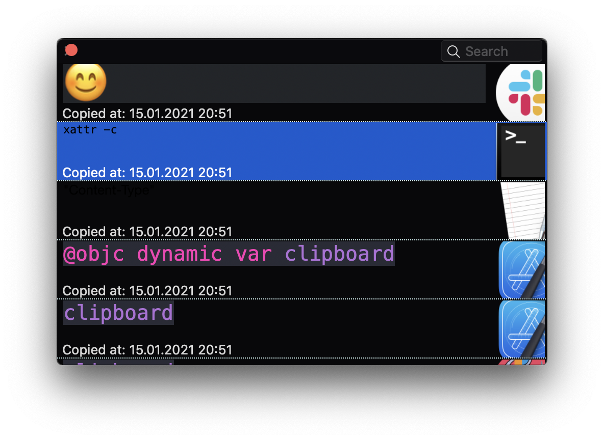

# Clippr

Good, free, and simple clipboard manager. (Hopefully)

What is wrong with modern clipboards?
- 1 item inventory is really bad
- No history of copied items
- No preview of copied items

## How this work

Clippr will check your pasteboard from time to time and cache it. 
Pasteboard may contain different types of data. Clippr will try to parse them and create the best possible representation.

Then you can access your history via hotkey or UI.

## How this looks

Item is selected using alt-v

## Release

Will be on AppStore. Available on [releases page](https://github.com/radulov/clippr/releases)

## Supported item types

- Text
- Image
- Color
- File

## History

This project is a part of the [old hackathon project](https://github.com/HammerSmashedFace/Clippr) from 2017. I was using it for some time, but it is really buggy and completely stop working somewhere on Mojave.
